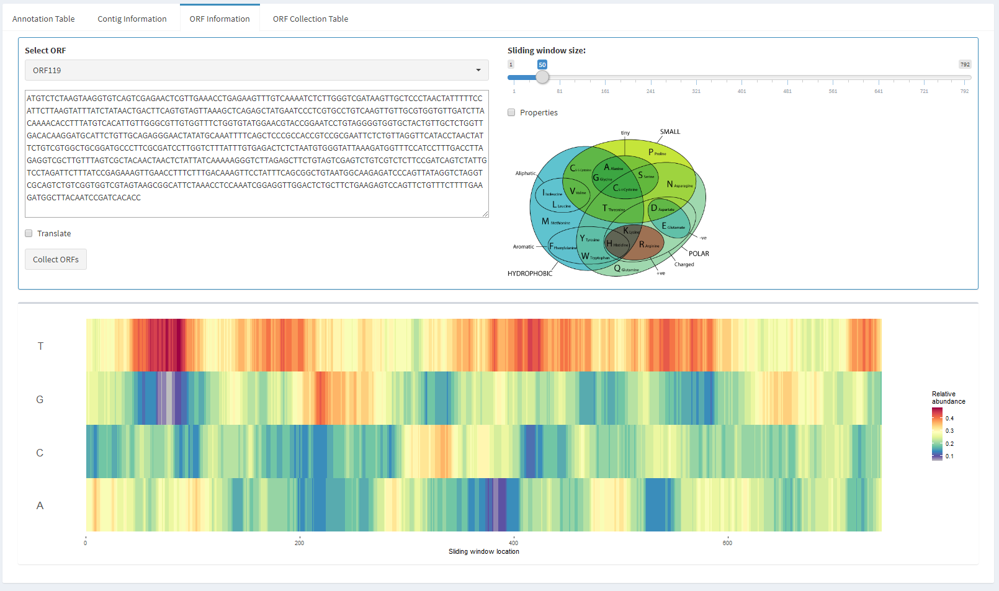

This vignette contains information about the use of the Virome Browser Shiny app contained in this package. The main purpose of this package is to easily distribute the app. Therefore, the only available function in the package is the `viromeBrowser()` function, which is used to create an instance of the Virome Browser Shiny app. However, all the code used to create the app is also available in the package's `app` folder. Below are some directions on how to load annotation and sequence data and how to browse through the data using the app.

## Starting a local instance of the Virome Browser

To start the shiny server, which hosts the app locally, execute the `viromeBrowser()` function.
This will start the Shiny app server and will indicate from what local adress the app can be reached (e.g. `http://127.0.0.1:7910`)
Alternatively you can host the app at a specific IP and port by specifying the host and port parameters of the `viromeBrowser()` function.

## Loading annotation data

Loading data into the app is performed in two steps. First, the analysis result metadata is fetched from the ENA dataportal by querying the dataportal using the provided study ID, sample ID, and/or analysis ID. This will give you information on what analysis files are present and which results you are about to download from the ENA. 

There are two errors that can be displayed when looking for metadata.

1. Your query did not return any data, perhaps the result files you are looking for are private and require you to login using your webin or DCC credentials.
2. You have tried to login using your webin or DCC credentials, but the password and/or username are wrong.

```{r, out.width = "680px", echo=FALSE}
knitr::include_graphics("image1.png")
```

After looking for analysis data you should see a table with entries in the "Available analysis files" box.
Select the data type corresponding to the data analysis files you would like to download and click load the data.
There are two possible errors when loading the data:

1. The analysis for which you are trying to load the data has not been performed on this data.
2. The data contains corrupted file, which will be ignored while loading the data.

You will see a status bar in the lower right corner of the screen. When you are loading many analysis results at once, this might take a while. When the analysis data loading is succesfull a new menu item will appear in the side menu on the left. 

Click on the "Sample heatmap" menu item to continue.

## Filtering and selecting annotation results using the interactive heatmap

Once you have loaded the annotation results into the app, you will be able to browse the results using the interactive heatmap. If the heatmap is overlapping with other parts of the interface, use your browsers zoom-out functionallity (CTRL/CMD - or CTRL/CMD scroll) to resize the app. You can also click on the button next to the "ViromeBrowser" title to collapse the side menu. In the heatmap, the file names are indicated on the x-axis and the selected annotations are located on the y-axis. You can add additional annotations by searching and selecting them in the search bar at the top.

The color grading of the heatmap corresponds to the relative number of annotated contigs in the corresponding sample.

The "Quality Filters" menu on the right indicated the filters you have selected for the analysis results. Filters can be set for contig length, identity, length of the match, fraction of the match compared to contig length and evalue of the match.

By dragging your cursor you can select one or multiple tiles of the heatmap.
Use shift+drag to select multiple individual tiles. This allows you to select specific annotations for further inspection, or downloading. Selecting an empty field, will reset the selection to all current annotations.

Click on the "Sequence information" menu item to continue.

```{r, out.width = "680px", echo=FALSE}
knitr::include_graphics("image2.png")
```

## Selecting results of interest

This table shows all the contigs and annotation information of the selected contigs.

You can select one or multiple lines of the table and click on "Download Selected" in the bottom of the screen to download the complete contig or contigs.

In addition, it is possible to inspect the selected contigs by clicking the "Contig information" tab.

```{r, out.width = "680px", echo=FALSE}
knitr::include_graphics("image3.png")
```

## Inspecting annotated sequences

The contig information tab shows you the annotation information of the selected contigs. Additionally a naive open reading frame prediction is performed by finding all canonical stop codons in all six frames of the contig. The predicted ORFs are displayed in the graph in the bottom. You can set a minimal ORF size limit with the slider.

Clicking the magnification glass in the graph allows you to zoom in and out. The two black lines indicate what part of the sequence has been annotated. Clicking one or multiple wedges (using shift+click) allows you to select a certain orf for further inspection.

Click on the "ORF information" tab to continue

```{r, out.width = "680px", echo=FALSE}
knitr::include_graphics("image4.png")
```

## Inspecting open reading frames

From the ORF information tab you can select and visualize the ORF sequence, translate it and look at the amino acid characteristics of the sequence. The sliding window size slider determines the sliding window size used to draw the heatmap in the bottom. By clicking the "Collect ORFs" button you can add these ORFs to the download list.

Click the "Sequence collection table" tab to continue

```{r, out.width = "680px", echo=FALSE}
knitr::include_graphics("image5.png")
```

## Downloading collected open reading frames

After collecting a single or multiple ORFs you can download the sequences of these ORFs as nucleotide or as amino acid fasta file by clicking the "Download Fasta" button. If you would like to clear the table, click the "Clear Collection" button.

```{r, out.width = "680px", echo=FALSE}

```

_If you have any questions, remarks or suggestions, please contact me at [d dot nieuwenhuijse at erasmusmc dot nl]_
