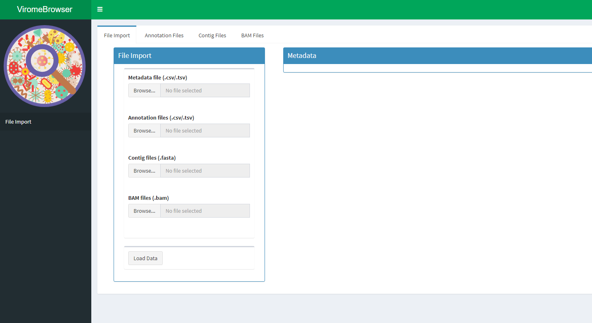
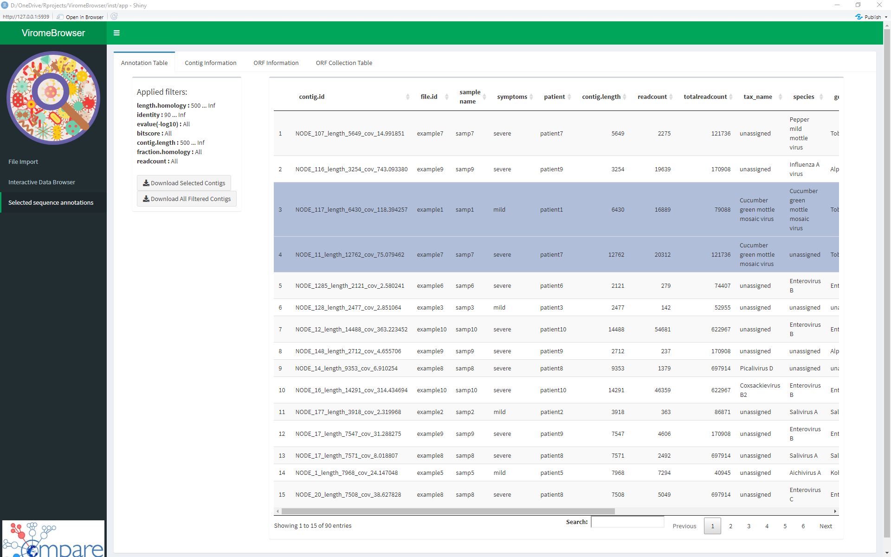
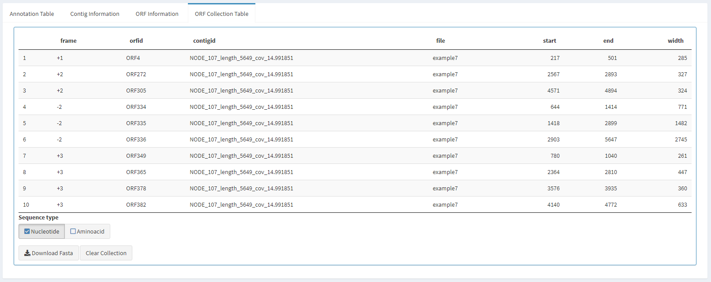

## How to use the Virome Browser

### Before you start
The Virome Browser shiny app makes it easy to import, filter and browse results generated from virome NGS data. The result files necessary to use the viromebrowser app are contig files, tabular formatted contig annotation files, read mapping files.

- The contig files can be generated with any de-novo or reference based assembly program and should be in FASTA format. 

- The annotation files should be generated with a BLAST like program and should be in BLAST format 6 as described here: http://www.metagenomics.wiki/tools/blast/blastn-output-format-6. In addition a column containing taxonomic identifiers should be available, which, when using BLAST, can be generated by adding the '-staxids' option when running the tool.

- The read mapping files can be generated by any short read aligner program and should contain the result of mapping the short reads used to generate the contigs to the contig fasta in BAM format.

R version 3.6.3 was used for the development of the Viromebrowser, R version 4.0.0 or later has not been tested. To run the viromeBrowser Rstudio version 1.2.5033 or later is recommended.

### Getting started

Run the following code to start the Virome Browser app locally on your computer:

```{r, eval=FALSE}
library(viromeBrowser)
viromeBrowser()
```

This will start the Shiny app server and will indicate from what local address the app can be reached (e.g. `http://127.0.0.1:3838` by default)
Alternatively you can host the app at a specific IP-address and port by specifying the host and port parameters of the `viromeBrowser()` function.

If R complains that the packages Biostrings and/or Rsamtools have not been installed install them with these commands:
```{r, eval=FALSE}
if (!requireNamespace("BiocManager", quietly = TRUE))
    install.packages("BiocManager")

BiocManager::install("Rsamtools")
BiocManager::install("Biostrings")
```

### Loading data into the Virome Browser

Four types of files must be loaded in the app:

- _Metadata:_ a metadata file containing a table with sample information. Metadata files must contain a header specifying the variable names and the first column of the table should correspond to the file names of the annotation files (without the file extension).

- _Annotation files:_ annotation files containing annotation details per analyzed contig. Currently, only BLAST-like tabular format is allowed with a single annotation per contig. The columns in the loaded annotation table have to correspond to the contig id, taxonomic annotations, contig length, etc. Make sure that the names of the annotation files are the same as noted in the metadata file. Also make sure that the contig ids match the names of the contigs in the fasta files. The minimal annotation data needed to use the rest of the application are a contig.id and an annotation, but any other annotations will make it possible to filter based on those annotations.

- _Contig files:_ fasta files containing the contigs that were annotated. Make sure that the contig names match the contig names in the annotation file and the file names match the file names of the annotation file (without the extension).

- _BAM files:_ the BAM files containing the results of mapping the reads of each sample to the generated contigs. The names of the contigs should again match the names of the contigs in the contig files. The name of the bam file should also match the name of the contig and annotation file.

After loading all the files press the "Load Data" button to start processing the files.

```{r, out.width = "680px", echo=FALSE}

```

After loading the data (wait for the loading bars to disappear) the tables under the panel "Metadata", "Annotation Files", "Contig Files" and "BAM Files" will be filled. These tables can be used to check whether the imported data was loaded correctly.

Two new menu items will also appear in the sidebar on the left, click on the "Interactive Data Browser" tab to continue.

### Filtering and selecting annotation results using the interactive data browser

There are three ways of filtering the annotation results:

- Metadata Filter Settings: Using the metadata filter settings you can select samples based on metadata parameters and select by which metadata parameter to stratify the displayed heatmap. Here you can also select to fill the heatmap with summed up contig counts, summed absolute read counts or summed relative read counts, scaled to the total number of reads in the mapping BAM file. There is also a selection field to indicate what level of taxonomy should be displayed in the heatmap.

```{r, out.width = "680px", echo=FALSE}
knitr::include_graphics("image2.png")
```

- Annotation filter setting: By default, annotation quality settings have been chosen to ensure high specificity of the displayed annotations. In order adjust the quality settings filters can be adjusted by adjusting the sliders. It is also possible to type in values for the slides in the "1000 ... 2000" notation format.

```{r, out.width = "680px", echo=FALSE}
knitr::include_graphics("image3.png")
```

- Interactive heatmap: The interactive heatmap can be used to select certain samples or annotations. Click on the heatmap to make a selection. If you do not select any tiles it is treated as if all tiles are selected. To deselect, click the deselect button.

After filtering and making a selection of annotations and samples, the next step is to either download the selected contigs or further inspect the contigs in the "selected sequence annotations" menu.

### Saving selected contigs

The table in "selected sequence annotations" part of the app shows the selected contigs based on the defined filter settings and their taxonomic lineage determined by calculating the lowest common ancestor for contigs with multiple annotations.

```{r, out.width = "680px", echo=FALSE}

```

You can select one or multiple lines of the table and click on "Download Selected Contigs" in the bottom of the screen to download the selected contigs. Use the "Download All Filtered Contigs" button to download all contigs in the current table __(This can take a while to process with a large number of contigs)__.

In addition, it is possible to inspect the selected contigs by clicking the "Contig Information" tab.

### Inspecting annotated contigs

The contig information tab shows you the annotation information of the selected contigs. Additionally a simple open reading frame prediction is performed by finding all canonical stop codons in all six frames of the contig. The predicted ORFs are displayed in the graph in the bottom. You can set a minimal ORF size limit with the slider.

Clicking the magnification glass in the graph allows you to zoom in and out. The two black lines indicate what part of the sequence has been annotated.

The "ORF Information" tab can be selected to further inspect the predicted open reading frames.

```{r, out.width = "680px", echo=FALSE}
knitr::include_graphics("image5.png")
```

### Inspecting open reading frames

In the ORF information tab you can select and visualize the ORF sequence, translate it and look at the amino acid characteristics of the sequence. The sliding window size slider determines the sliding window size over which a density is calculated and displayed in the heatmap in the bottom. By clicking the "Collect ORFs" button you can add all predicted ORFs to a download list.

Click the "Sequence collection table" tab to continue

```{r, out.width = "680px", echo=FALSE}
knitr::include_graphics("image6.png")
```

### Downloading collected open reading frames

After collecting ORF sequences you can download the sequences of these ORFs as nucleotide or as amino acid fasta file by clicking the "Download Fasta" button. If you would like to clear the table, click the "Clear Collection" button.

```{r, out.width = "680px", echo=FALSE}

```

