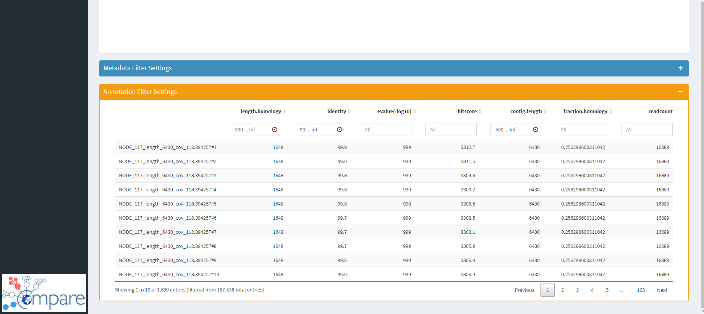
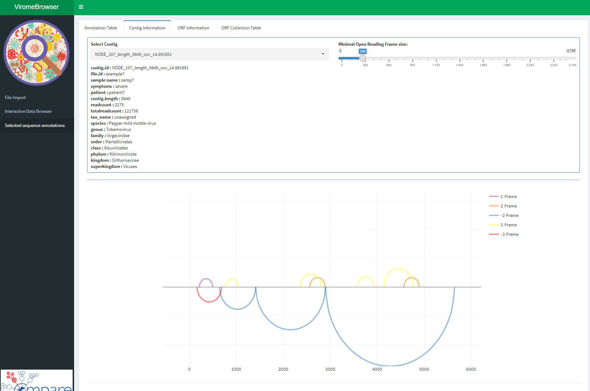

## How to use the Virome Browser

The Virome Browser shiny app makes it easy to import, filter and browse results generated from virome NGS data. These results generally consist of a file with contiguous sequences, so called "contigs" and tabular files annotating those contigs. Currently only BLAST-like annotation files are allowed as an input, however, other types of annotation files can be easily implemented in future releases of the Virome Browser.

### Getting started

Run the following code to start the Virome Browser app locally on your computer:

```{r, eval=FALSE}
library(viromeBrowser)
viromeBrowser()
```

This will start the Shiny app server and will indicate from what local address the app can be reached (e.g. `http://127.0.0.1:3838` by default)
Alternatively you can host the app at a specific IP-address and port by specifying the host and port parameters of the `viromeBrowser()` function.

### Loading data into the Virome Browser

Three types of files must be loaded in the app:

- _Metadata:_ a metadata file containing a table with sample information. Metadata files must contain a header specifying the variable names and the first column of the table should correspond to the file names of the annotation files (without the file extension).

- _Annotation files:_ annotation files containing annotation details per analyzed contig. Currently, only BLAST-like tabular format is allowed. The columns in the table have to correspond to the: contig id,	annotation,	contig length, hit start,	hit end, hit size,	hit size fraction compared to the reference genome, frame of the hit, sequence identity, evalue and target reference. Make sure that the names of the annotation files are the same as noted in the metadata file. Also make sure that the contig ids match the names of the contigs in the fasta files.

- _Contig files:_ fasta files containing the contigs that were annotated. Make sure that the contig names match the contig names in the annotation file and the file names match the file names of the annotation file (without the extension).

After loading all the files press the "Load Data" button to start processing the files.

The "Load example data" switch can be used to load a small example dataset. Turn the switch off again to load your own data.

```{r, out.width = "680px", echo=FALSE}
knitr::include_graphics("image1.png")
```

After loading the data the tables under the panel "Metadata", "Annotation Files" and "Contig Files" will be filled. These tables can be used to check whether the imported data was loaded correctly.

Two new menu items will be also appear in the sidebar on the left, click on the "Interactive Data Browser" tab to continue.

### Filtering and selecting annotation results using the interactive data browser

There are three ways of filtering the annotation results:

- Browsing settings: Using the browsing settings you can select samples based on metadata parameters and select by which metadata parameter to stratify the displayed heatmap. You can add up to 9 filters.

- Interactive heatmap: The interactive heatmap can be used to select certain samples or annotations. Click and drag on the heatmap to make a selection. By default all of the tiles are selected. To deselect, click and drag in the heatmap in an area without tiles.

```{r, out.width = "680px", echo=FALSE}
knitr::include_graphics("image2.png")
```

- Advanced settings: By default, annotation quality settings have been chosen to ensure high specificity of the displayed annotations. In order adjust the quality settings switch off the "Use default filters" switch. Filters can be adjusted by adjusting the sliders or dropdown menu's. It is also possible to type in values for the slides in the "1000 ... 2000" notation format.

```{r, out.width = "680px", echo=FALSE}

```

After making a selection of annotations and samples, the next step is to either download the selected contigs or further inspect the contigs in the sequence information menu.

### Saving selected contigs

The table in the sequence information menu shows all the contigs and annotation information of the selected contigs.

```{r, out.width = "680px", echo=FALSE}
knitr::include_graphics("image4.png")
```

You can select one or multiple lines of the table and click on "Download Selected" in the bottom of the screen to download the selected contigs. Use the "Download All" button to download all contigs __(This can take a while to process with a large number of contigs)__.

In addition, it is possible to inspect the selected contigs by clicking the "Contig Information" tab.

### Inspecting annotated contigs

The contig information tab shows you the annotation information of the selected contigs. Additionally a simple open reading frame prediction is performed by finding all canonical stop codons in all six frames of the contig. The predicted ORFs are displayed in the graph in the bottom. You can set a minimal ORF size limit with the slider.

Clicking the magnification glass in the graph allows you to zoom in and out. The two black lines indicate what part of the sequence has been annotated.

The "ORF Information" tab can be selected to further inspect the predicted open reading frames.

```{r, out.width = "680px", echo=FALSE}

```

### Inspecting open reading frames

In the ORF information tab you can select and visualize the ORF sequence, translate it and look at the amino acid characteristics of the sequence. The sliding window size slider determines the sliding window size over which a density is calculated and displayed in the heatmap in the bottom. By clicking the "Collect ORFs" button you can add all predicted ORFs to a download list.

Click the "Sequence collection table" tab to continue

```{r, out.width = "680px", echo=FALSE}
knitr::include_graphics("image6.png")
```

### Downloading collected open reading frames

After collecting ORF sequences you can download the sequences of these ORFs as nucleotide or as amino acid fasta file by clicking the "Download Fasta" button. If you would like to clear the table, click the "Clear Collection" button.

```{r, out.width = "680px", echo=FALSE}
knitr::include_graphics("image7.png")
```

